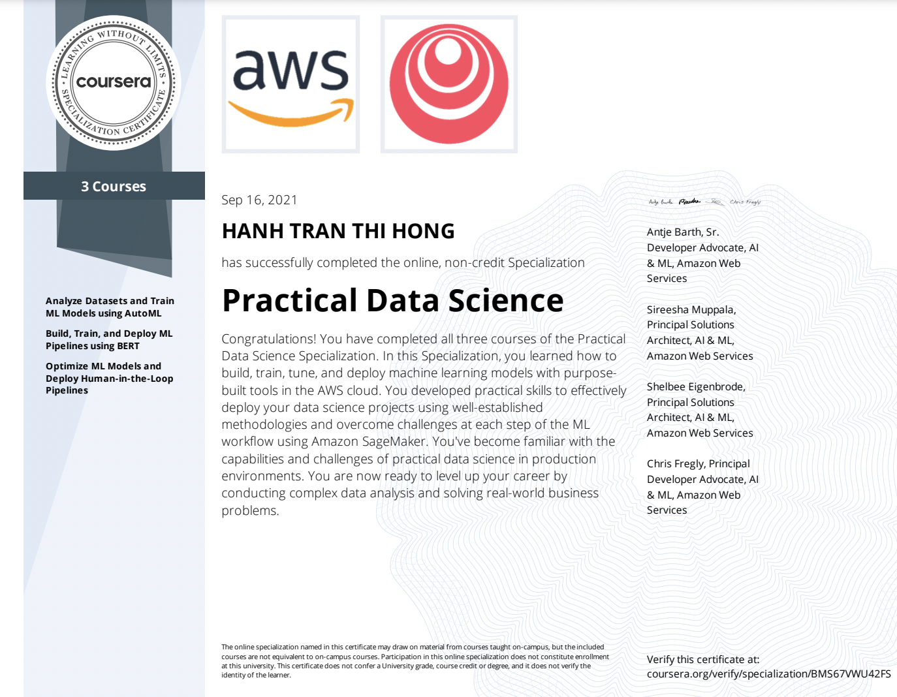

# Solutions on Practical Data Science Specialization

Access all courses in the Coursera [Practical Data Science Specialization](https://www.coursera.org/specializations/practical-data-science) Specialization offered by `deeplearning.ai`.

This repo contains the **SOLUTIONS** of exercises/labs to achieve the badge.

<!-- {width=50%} -->

## Course keynotes and solutions of related quizzes, assignments

Practical Data Science Specialization on Coursera contains three courses:

### 1. [Course 1: Analyze Datasets and Train ML Models using AutoML](https://www.coursera.org/learn/automl-datasets-ml-models?specialization=practical-data-science)

#### Week 1:

<!-- - [x] Keynotes:

> 1. **Artificial Intelligence (AI)** mimics human behavior.

> 2. **Machine Learning (ML)** is a subset of AI that uses statistical methods and algorithms that are able to learn from data without being explicitly programmed.

> 3. **Deep learning (DL)** is a subset of machine learning that uses artificial neural networks to learn from data.

> 4. **AWS SageMaker** -->

- [x] Practice Quiz:  [Week 1](./course1/week1/Week1_Practice_Quiz.pdf).

- [x] Graded External Tool: [Register and visualize dataset](./course1/week1/C1_W1_Assignment.ipynb).

#### Week 2: 

<!-- - [x] Keynotes:

> 1. **Statistical Bias**: Training data does not comprehensively represent the underlying problem space.

> 2. **Statistical Bias Causes**: Activity Bias, Societal Bias, Selection Bias, Data Drift/Shift, ...

> 3. **Class Imbalance (CI)** measures the imbalance in the number of members between different facet values.

> 4. **Detecting Statistical Bias** by AWS SageMaker DataWrangler and AWS SageMaker Clarify.

> 5. **Feature Importance** explains the features that make up the training data using a score. How useful or valuable the feature is relative to other features?

> 5. **SHAP (SHapley Additive exPlanations)** -->

- [x] Practice Quiz: [Week 2](./course1/week2/Week2_Practice_Quiz.pdf).

- [x] Graded External Tool: [Detect data bias with Amazon SageMaker Clarify](./course1/week2/C1_W2_Assignment.ipynb).

#### Week 3: 

<!-- - [x] Keynotes:

> 1. **Data Prepreration** includes Ingesting & Analyzing, Prepraring & Transforming, Training & Tuning, and Deploying & Managing. 

> 2. **AutoML** aims at automating the process of building a model.

> 3. **Model Hosting**. -->

- [x] Practice Quiz: [Week 3](./course1/week3/Week3_Practice_Quiz.pdf).

- [x] Graded External Tool: [Train a model with Amazon SageMaker Autopilot](./course1/week3/C1_W3_Assignment.ipynb).

#### Week 4:

<!-- - [x] Keynotes

> 1. **Built-in Alogrithms** in AWS SageMaker supports Classification, Regression, and Clustering problems.

> 2. **Text Analysis Evolution**: Word2Vec (CBOW & Skip-gram), GloVe,  FastText, Transformer, BlazingText, ELMo, GPT, BERT, ... -->

- [x] Practice Quiz: [Week 4](./course1/week4/Week4_Practice_Quiz.pdf).

- [x] Graded External Tool: [Train a text classifier using Amazon SageMaker BlazingText built-in algorithm](./course1/week4/C1_W4_Assignment.ipynb).

---

### 2. [Course 2: Build, Train, and Deploy ML Pipelines using BERT](https://www.coursera.org/learn/ml-pipelines-bert?specialization=practical-data-science)

#### Week 1 

<!-- - [x] Keynotes

> 1. **Feature Engineering** involves converting raw data from one or more sources into meaningful features that can be used for training machine learning models.

> 2. **Feature Engineering Step** includes feature selection, creation, and transformation.

> 3. **BERT** is Transformer-based pretrained language models that sucessfully capture bidirectional contexts in word representation.

> 4. **Feature Store**: centralized, reusable, discoverable. -->

- [x] Practice Quiz: [Week 1](./course2/week1/Week1_Practice_Quiz.pdf).

- [x] Graded External Tool: [Feature transformation with Amazon SageMaker processing job and Feature Store](./course2/week1/C2_W1_Assignment.ipynb).

#### Week 2

<!-- - [x] Keynotes

> Learn how to train a customized **Pretrained BERT** and its variant models, debug, and profile with AWS SageMaker. -->

- [x] Practice Quiz: [Week 2](./course2/week2/Week2_Practice_Quiz.pdf).

- [x] Graded External Tool: [Train a review classifier with BERT and Amazon SageMaker](./course2/week2/C2_W2_Assignment.ipynb).

#### Week 3
<!-- 
- [x] Keynotes

> 1. **MLOps** builds on DevOps practices that encompass people, process, and technology. MLOps also includes considerations and practices that are really unique to machine learning workloads. -->

- [x] Practice Quiz: [Week 3](./course2/week3/Week3_Practice_Quiz.pdf).

- [x] Graded External Tool: [SageMaker pipelines to train a BERT-Based text classifier](./course2/week3/C2_W3_Assignment.ipynb).

---

### 3. [Course 3: Optimize ML Models and Deploy Human-in-the-Loop Pipelines](https://www.coursera.org/learn/ml-models-human-in-the-loop-pipelines?specialization=practical-data-science)

#### Week 1 

<!-- - [x] Keynotes

> 1. **Model Tuning** aims to fit the model to the underlying data patterns in your training data and learn the best possible parameters for your model.

> 2. **Automatic Model Tuning** includes grid search, random search, bayesian optimization, hyperband.

> 3. **Challenges**: checkpointing, distribution training strategy. -->

- [x] Practice Quiz:  [Week 1](./course3/week1/Week1_Practice_Quiz.pdf).

- [x] Graded External Tool: [Optimize models using Automatic Model Tuning](./course3/week1/C3_W1_Assignment.ipynb).

#### Week 2

<!-- - [x] Keynotes -->

- [x] Practice Quiz: [Week 2](./course3/week2/Week2_Practice_Quiz.pdf).

- [x] Graded External Tool: [A/B testing, traffic shifting and autoscaling](./course3/week2/C3_W2_Assignment.ipynb).

#### Week 3

<!-- - [x] Keynotes -->

- [x] Practice Quiz:  [Week 3](./course3/week3/Week3_Practice_Quiz.pdf).

- [x] Graded External Tool: [Data labeling and human-in-the-loop pipelines with Amazon Augmented AI (A2I)](./course3/week3/C3_W3_Assignment.ipynb).

---
	
## Disclaimer

The solutions here are **ONLY FOR REFERENCE** to guide you if you get stuck somewhere. Highly recommended to try out the quizzes and assignments yourselves first before referring to the solutions here.

Feel free to discuss further with me on .
